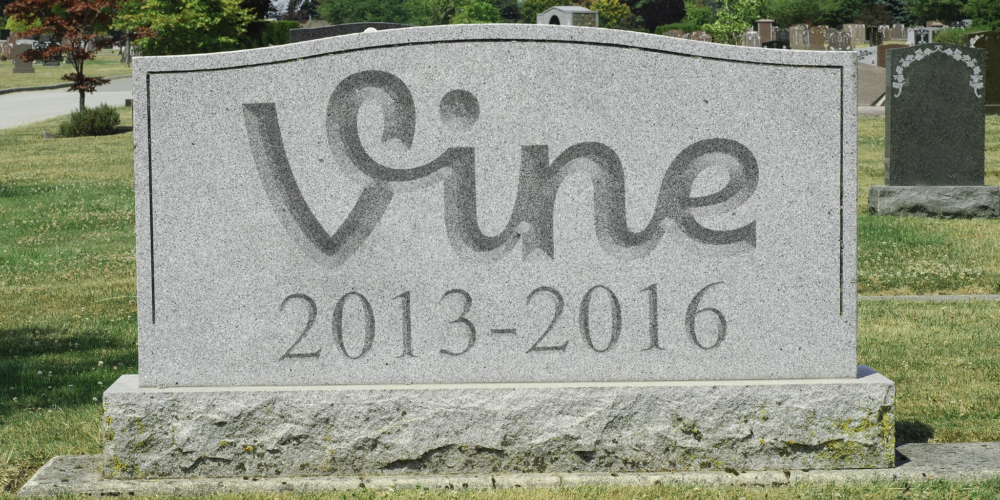

# IASC-2P02| Jamie Foster

## Bio

I am a fifth-year University student studying English Language and Literature and Interactive Arts and Science. I have a deep interest in video games and the gaming industry as well as the ESports community. I am most interested in cultural studies, specifically how small blips in pop-culture and seemingly small media effects our culture in broad hindsight. My work represents my interest in this field by examining these media innovations and how they resonate througout our modern culture. My research on the social-media app Vine, for example, explores exactly how this small piece of technology changed the broad internet culture that our world is slipping more and more into. 
From here, I would like to conduct more extensive research on internet culture and meme pop-culture. Much like how the most popular British anthologies in the 18th and 19th century shed sosme light on western culture in that time preriod, meme trends, formats, common threads, topics and themes reflect perspectives within our society, especially those from teens and young adults which are normally looked past. Memes are a way of communicating in funny, topical and relatible ways that mostly everybody who knows how to work a computer can create and share, which makes memes a very important medium to analyze in cultural studies. 

## Featured Project: [Vine: The 3 Years that Changed Everything]

This presentation is a look at the social media app Vine through the lense of media archeology. The Vine launched and closed down within 3 years (2013-2016), but it took internet culture to a new level with features that were at the time new to mobile apps. This presentation focuses on the cultural effect this media had, which completely changed the format and humour of memes, which has become a popular mode for people tell, share and relate to regular human experiences through the internet and can express it in a way that is easily consumable, creative and entertaining. 
While conducting research, it became evident that the residual effect of this application is still felt, and while many feel that Vine was insignificant and a failure, it has changed the course of pop-culture-or sped it up- mainly in teens and young adults.
This is an important aspect if culture to study because as society is networking more and more through the internet, internet culture as a separate entity can no longer be placed inside it's own box as if separate. This way of communicating through memes is done millions of times a day, everyday by the very people who will soon be the ones runnign the world, and it can not be ignored. Vine is an important moment in this internet culture history, and this is a breif look at its short but very impactful history. 

My research for this project started with basic timeline information, which made me really realize how quick Vine started and ended, the three years span felt longer while it was happening, but of course hindsight changes how things seem, especially culturally. I also chose to look more into how this affected genral media and made my retrospectively analyze how internet culture and memes had changed from before Vine's release and after it ended. After the initial presentation and feedback was recieved, I fixed up some thing that weren't working from the technical side, which you can see [here](https://github.com/Jamie-F42/IASC-2P02/commit/9bb6e17a2ab4e29d43536eeb3b8d3b4b383e3984#diff-890f068779e43beb317787310daafa5c). I also added the additional slides, which allowed me to get out exactly why this research project is important to culturala studies and digital humanities in general. These 5 additional slides gave me the space to layout my points and how it related to media archeology as a whole, which you can see [here](https://github.com/Jamie-F42/IASC-2P02/commit/d9cb907e9de61368005d62bf811a5c1a74e893a7#diff-890f068779e43beb317787310daafa5c). After I was happy with the content I made sure everything worked and touched it up that one last bit, ensuring the pictures were relevant and the order of the slides reflected the trip I want to take the viewer on, and you can see those [here](https://github.com/Jamie-F42/IASC-2P02/commit/294f5de65a4aba9aaf82f956f0c6e1fee47e22cf#diff-890f068779e43beb317787310daafa5c). 

[Click Here to #DoitFortheVine](https://jamie-f42.github.io/IASC-2P02/reveal/)

## Collaborative Project

The collaborative project I helped with was an examination of Humanities Commons, a free public access site for academic discussion. People could create free accounts, post their own published or unpublished work, view others projects, join and browse groups and forums with academic topics and discussion. We wanted to explore all the different way one could use and contribute to the site. 
It was important in this collaboration to wrk together without getting in each other's way, so right away I dived the sections into relatively similar amounts of work and we each picked which part we would like to work on. This way it was a group project as a whole, but we all had our own task to complete on our own time. This was efficient because everyone got a say in what part they did, and each member of the group knew exactly what they had to complete in time for our presentation. I also liked this method because it eliminated the need to meet all as a group, which in my opinion is tiresome, wastes time and is usually very hard to even coordinate due to busy student schedules.
I chose to do the Theoretical Analysis section of our collaborative project, as I felt theory and discussion is my strong suit and I believed I could do it well. This can be seen [here](https://github.com/IascAtBrock/IASC-2P02-TeamPresentations/blob/Team2/Theoretical%20Discussion/HC%20Theoretical%20Disscussion.docx). I also contributed these assets to my team, seen below, which are captures of the kind of theoretical discussion I wanted to conduct in this project.

## Academic Blog

[Data Visualization and Why Everyone is Screaming About It](https://github.com/Jamie-F42/IASC-2P02/blob/master/Blog.md)

## Research Presentation

[Click Here](https://jamie-f42.github.io/IASC-2P02/reveal/)
